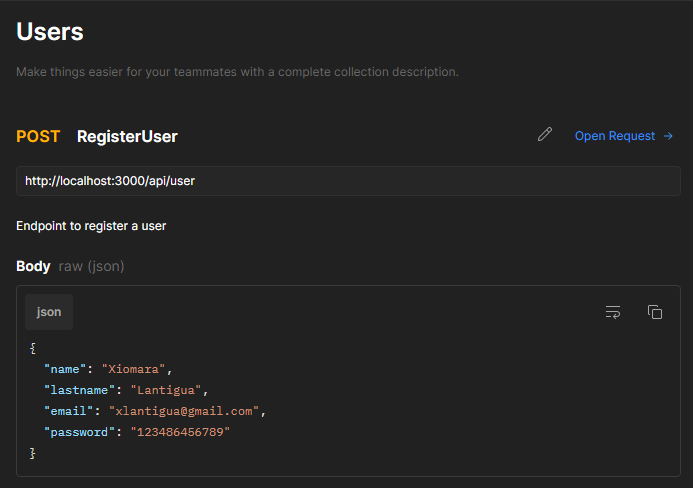
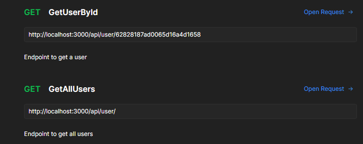
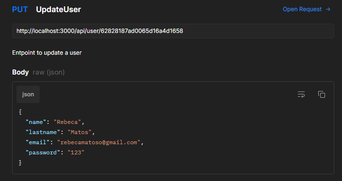
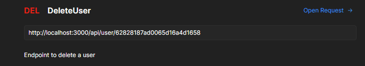

# NODE API USERS 

#### This is an example node api, in it you can make use of the http methods shown below :point_down:

### POST METHOD

### GET METHODS

### UPDATE METHOD

### DELETE METHOD

# STILL WORKING ON IT.