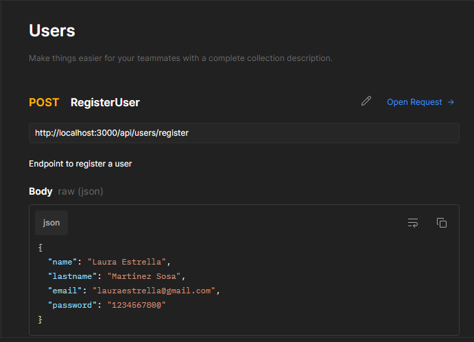

# NODE API USERS

<!--Badges Section ---  you can modify then ot got to shields.io to get then -->

#### This is an example node api, in it you can make use of the http methods shown below :point_down:

### REGISTER METHOD

### LOGIN METHOD

### GET ALL METHOD

### GET BY ID METHOD

### GET BY NAME METHOD

### UPDATE BY ID METHOD

### DELETE BY ID METHOD

### Link to postman methods documentation :point_down:
* [Postman Documentation Methods](https://documenter.getpostman.com/view/17706643/Uz5ArJLE)

# STILL WORKING ON IT.
